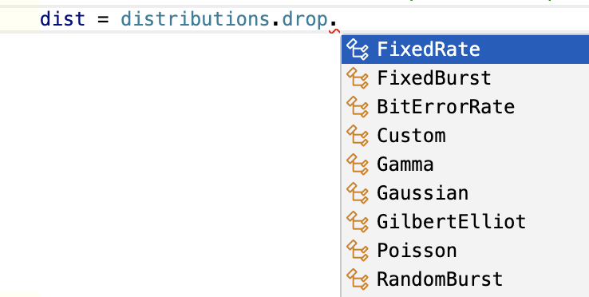
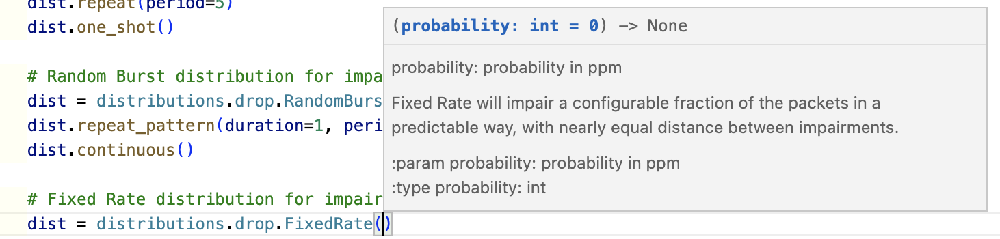

API Reference
=========================

The XOA Chimera Core offers a convenient auto-complete feature and includes a built-in API manual tailored for modern IDEs such as VSCode. 

    As you write your code, a drop-down list will display all the available functions for the object, making coding faster and more efficient.

    The built-in API manual shows the parameters and the returned type of the function.

**The code example below includes all available APIs you can use to:**

1. Connect to a Valkyrie chassis, and select a port of a Chimera module
2. Configure Chimera port
3. Configure flow's basic filter 
4. Configure flow's extended filter
5. Configure impairment - Drop
6. Configure impairment - Misordering
7. Configure impairment - Latency & Jitter
8. Configure impairment - Duplication
9. Configure impairment - Corruption
10. Configure bandwidth control - Policer
11. Configure bandwidth control - Shaper
12. Flow statistics
13. Port statistics

.. literalinclude:: ../getting_started/quick_start.py
    :language: python